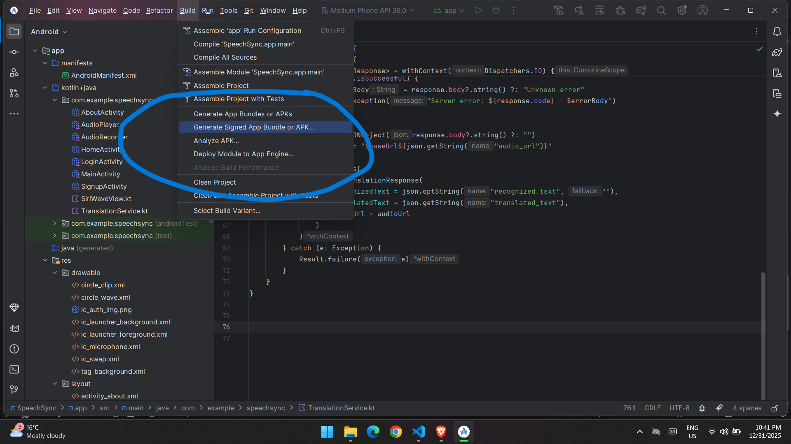
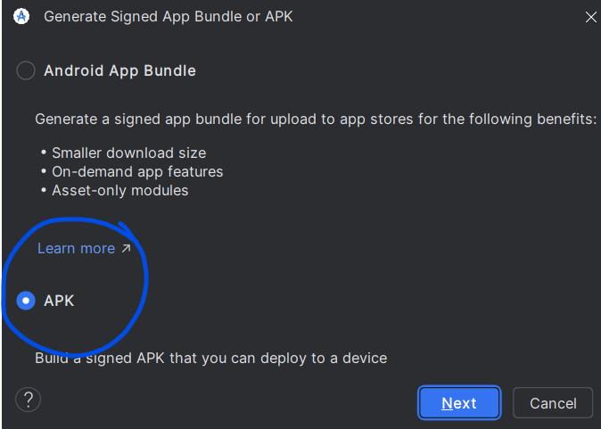
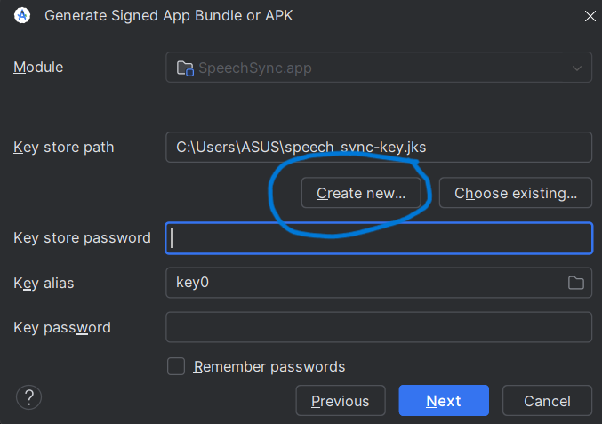
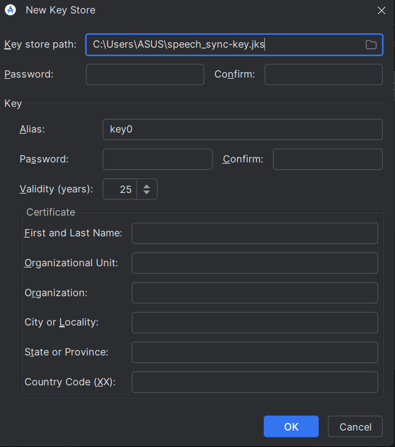
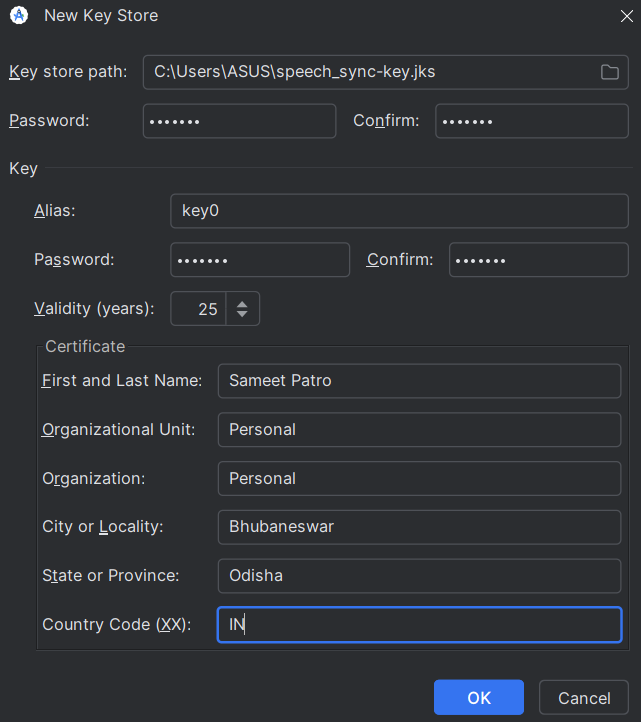
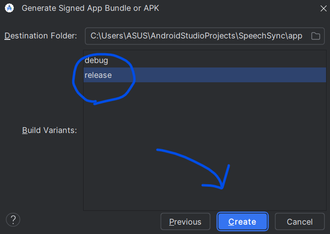

# 🎙️ Design and Implementation of an Android-Based Speech Translation Application for Indic Languages

## Overview

This project is an **Android-based speech-to-speech translation application** that converts spoken audio from one language into **spoken output in another language**, with a primary focus on **Indic languages**.

The application uses:
- **Kotlin (Android)** for the frontend
- **Flask (Python)** as the backend server
- Deep learning models for **Speech-to-Text, Translation, and Text-to-Speech**

The Android app communicates with the Flask server through a REST API.

---

## System Architecture

<!-- PLACE ARCHITECTURE IMAGE HERE -->

**Flow:**
1. User records speech in the Android app  
2. Audio is sent to the Flask backend  
3. Backend performs:
   - Speech Recognition
   - Language Translation
   - Speech Synthesis  
4. Translated speech is sent back and played on the device  

---

## 🛠️ Tech Stack

### Android (Frontend)
- Kotlin
- Android Studio
- Audio Recorder
- HTTP API communication

### Backend (Flask Server)
- Python
- Flask
- PyTorch
- Hugging Face Transformers
- Whisper (Speech-to-Text)
- NLLB / IndicTrans (Translation)
- gTTS
- NumPy, Librosa, SoundFile

---

## 🧩 Prerequisites

Before starting, make sure you have:

- A laptop/PC (Windows / Linux / macOS)
- Internet connection
- Git installed
- **Python 3.9 or above**
- **Android Studio (mandatory for frontend)**

---

## 📥 Installing Android Studio (IMPORTANT)

1. Go to the official Android Studio website:  
   https://developer.android.com/studio

2. Download **Android Studio (Stable Version)** for your OS

3. Install it using default settings  
   - Do **not** skip SDK installation
   - Allow it to install Android SDK, Platform Tools, and Emulator

4. Launch Android Studio after installation

5. On first launch:
   - Select **Standard Installation**
   - Accept all licenses
   - Wait for SDK components to download

⚠️ This step can take **10–20 minutes** depending on internet speed.

---

## 📂 Backend Repository

Backend source code:  
🔗 https://github.com/Sameetpatro/ss_pipeline_B

---

## 🚀 Backend Setup

### 1️⃣ Clone the Backend Repository

```bash
git clone https://github.com/Sameetpatro/ss_pipeline_B.git
cd ss_pipeline_B
```

## 📱 Frontend (Android App) Setup

After successfully setting up and running the Flask backend, follow the steps below to set up the Android application.

---

### Clone the Android Frontend Repository

Open a new terminal (or use the same one) and run:

```bash
git clone https://github.com/Sameetpatro/SpeechSync.git
```

### Configure Backend (Flask) Server URL

After opening the project in Android Studio, you must configure the Flask server URL so that the Android app can communicate with the backend.

#### Open the Translation Service File

Navigate to the following file in Android Studio:

```text
SpeechSync/app/src/main/java/com/example/speechsync/TranslationService.kt
```

---

### Insert Your Backend Server URL

Inside `TranslationService.kt`, locate the variable where the backend API base URL is defined.

It will look similar to this:

```kotlin
private const val BASE_URL = "url here"
```

Insert your Server URL there 

---

## 📦 How to Generate a Signed APK File

Follow these steps to generate a **signed APK** that can be installed on any Android device.

---

---

## 📦 How to Generate a Signed APK File

Follow these steps to generate a **signed APK** that can be installed on any Android device.

---

### Step 1: Open Generate Signed APK Option



In Android Studio:
1. Click on **Build** from the top menu
2. Select **Generate Signed App Bundle / APK**
3. Tap **Next**

---

### Step 2: Choose APK Option




- Select the **APK** option
- Click **Next**

---

### Step 3: Create or Select Keystore




- If you already have a **keystore for this app**, select it
- Otherwise, tap **Create new**
- This keystore will be used to sign your app

---

### Step 4: Create New Keystore (Only If Creating for First Time)




Fill in all the required details:
- Keystore path
- Password
- Key alias
- Key password
- Validity period
- Certificate information (Name, Organization, Country, etc.)

The screen should look similar to the image above.

---

### Step 5: Complete Keystore Details




- Enter the **keystore password**
- Enter the **key password**
- Confirm all fields are correct
- Tap **Next**

---

### Step 6: Build Signed APK




- Select **Release** as the build variant
- Tap **Create**
- Wait for the build process to complete

After a few moments, Android Studio will display a message confirming that the **signed APK has been generated successfully**.

---

### Step 7: Locate the APK File

The signed APK will be available at:

```text
app/release/app-release.apk
```